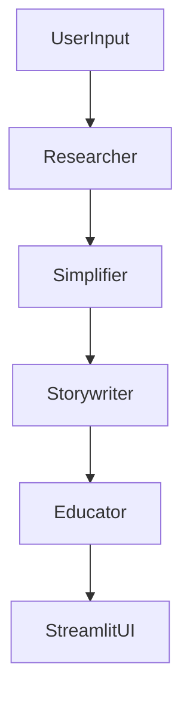

# 🧠 StoryBot - Explain Like I'm 5

Ever wanted to understand complex topics in a way even a child can grasp? This project turns **any topic** into a delightful short story understandable by a 5-year-old — using a team of autonomous AI agents powered by **CrewAI**, **Gemini-2.0-Flash**, and **Streamlit**.

## 🎨 Modern UI

The app features a stunning, child-friendly design with:
- ✨ **Gradient animations** and smooth transitions
- 🎯 **Interactive elements** with hover effects
- 🌈 **Warm, cozy color palette** perfect for children's stories
- 📱 **Responsive design** that works on all devices
- 🎭 **Engaging emojis** and visual elements
- 💫 **Modern typography** with gradient text effects

## 🚀 Live Demo

⚠️ **Currently Unavailable on Streamlit Cloud**

This app cannot be deployed on Streamlit Cloud due to a **SQLite version compatibility issue**. CrewAI (the multi-agent framework used here) depends on ChromaDB, which requires SQLite 3.35+ for its vector database operations. However, Streamlit Cloud currently uses an older SQLite version (3.31), causing deployment failures.

**Error:** `RuntimeError: Your system has an unsupported version of sqlite3. Chroma requires sqlite3 >= 3.35.0.`

**Solutions:**
- 🏠 **Run locally** (instructions below)
- ☁️ **Deploy on other platforms** (Heroku, AWS, GCP, etc.) where you can control SQLite versions
- 🔄 **Wait for Streamlit Cloud** to upgrade their SQLite version

👉 [Run Locally](#-how-to-run-locally)

---

## 🎯 What It Does

When a user inputs a topic, a multi-agent system collaborates to:
1. **Research** the topic for accurate information.
2. **Simplify** the technical language and concepts.
3. **Weave a story** with age-appropriate metaphors.
4. **Review** the story for clarity and engagement for a 5-year-old.

The final story is displayed in an interactive Streamlit UI with stunning visual effects.

---

## 🧩 Features

- ✨ **Natural-language input** for any topic  
- 🧠 **Autonomous multi-agent reasoning** pipeline  
- 📖 **Age-appropriate storytelling** using Gemini  
- 🎨 **Modern UI** with animations and effects
- 📱 **Fully responsive design** for all devices
- 🛠 **Modular and extensible** agent/task architecture  
- 🌈 **Warm, cozy color scheme** and typography

---

## 🎨 Design Highlights

### Visual Elements
- **Warm gradient backgrounds** with smooth animations
- **Floating emoji decorations** throughout the interface
- **Custom button styling** with hover effects
- **Story containers** with shadows and borders
- **Animated success/warning/error messages**

### User Experience
- **Intuitive input field** with helpful placeholder text
- **Engaging loading animations** during story generation
- **Clear visual feedback** for all user actions
- **Smooth transitions** between different states
- **Accessible color scheme** with good contrast

---

## 🧩 Crew Architecture

Each agent is configured with a **role**, **goal**, **task**, and **backstory** to create a believable and effective multi-agent pipeline.

**Agents:**
- 🧑‍🔬 Researcher  
- 📘 Simplifier  
- 🧙 Storywriter  
- 👶 Educator (Reviewer)

**Flow:**


---

## 🔮 Roadmap

- 🎨 **Story illustration** with DALL·E
- 🌍 **Multi-language support**
- 🔊 **Text-to-speech narration**
- 📅 **Save story as PDF** or share via link
- 🎭 **More animation effects** and interactive elements

---

## 🛠 Tech Stack

- [CrewAI](https://github.com/joaomdmoura/crewAI) — Multi-agent LLM framework  
- [Gemini-2.0-Flash](https://gemini.google.com/app) — Language model backend  
- [Streamlit](https://streamlit.io/) — UI for user interaction  
- [Custom CSS](style.css) — Advanced styling and animations
- Python 3.11+

---

## 📂 Project Structure

```
story-bot-ELI5/
│
├── storybot_llm_eli5_streamlit.py       # Streamlit UI
├── storybot.py                          # Agent and Task definitions
├── storybotcrew.py                      # Crew definitions and orchestration
├── style.css                            # Additional CSS animations
├── .streamlit/config.toml               # Streamlit theme configuration
├── .env                                 # API key config
├── requirements.txt                     # Python dependencies
├── packages.txt                         # System dependencies
├── runtime.txt                          # Python version specification
└── README.md                            # You're here!
```

---

## 🧪 How to Run Locally

### 1. Clone the Repo

```bash
git clone https://github.com/yourusername/crewai-storybot.git
cd story-bot-ELI5
```

### 2. Install Dependencies

```bash
pip install -r requirements.txt
```

### 3. Add Your API Key

Create a `.env` file and add:

```env
GEMINI_API_KEY=your-gemini-api-key
```

### 4. Launch the App

```bash
streamlit run storybot_llm_eli5_streamlit.py
```

---

## 🎨 Customization

The app uses a warm, cozy design that can be easily customized:

### Colors
- **Primary**: Warm orange gradient (#FF8C42)
- **Secondary**: Purple gradient (#9B59B6)
- **Background**: Warm cream (#FFF8F0)
- **Text**: Dark charcoal (#2D3748)
- **Accent**: Golden orange (#F6AD55)

### Animations
- **Floating emojis** with smooth transitions
- **Button hover effects** with elevation
- **Gradient text** with warm color effects
- **Pulse animations** for important elements

---

## 🤝 Contributions

Contributions are welcome! Open an issue or submit a PR with improvements or ideas.

---

## 📜 License

MIT License. Use it, remix it, share it freely.

---

> "If you can't explain it simply, you don't understand it well enough." – *Albert Einstein*