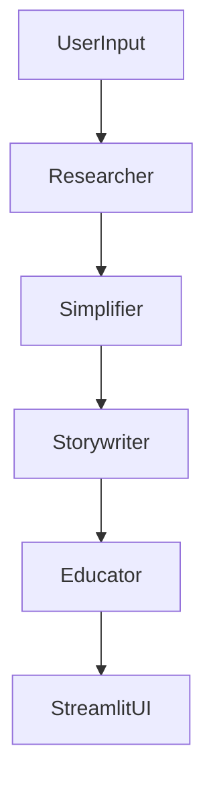

# 🧠 StoryBot - Explain Like I'm 5

Ever wanted to understand complex topics in a way even a child can grasp? This project turns **any topic** into a delightful short story understandable by a 5-year-old — using a team of autonomous AI agents powered by **CrewAI**, **Gemini-2.0-Flash**, and **Streamlit**.

## 🚀 Live Demo

👉 [Launch the App on Streamlit](#)

---

## 🎯 What It Does

When a user inputs a topic, a multi-agent system collaborates to:
1. **Research** the topic for accurate information.
2. **Simplify** the technical language and concepts.
3. **Weave a story** with age-appropriate metaphors.
4. **Review** the story for clarity and engagement for a 5-year-old.

The final story is displayed interactively in a clean Streamlit UI.

---

## 🧩 Features

- ✨ Natural-language input for any topic  
- 🧠 Autonomous multi-agent reasoning pipeline  
- 📖 Age-appropriate storytelling using Gemini  
- 🖼️ Clean Streamlit UI  
- 🛠 Modular and extensible agent/task architecture  

---

## 🧩 Crew Architecture

Each agent is configured with a **role**, **goal**, **task**, and **backstory** to create a believable and effective multi-agent pipeline.

**Agents:**
- 🧑‍🔬 Researcher  
- 📘 Simplifier  
- 🧙 Storywriter  
- 👶 Educator (Reviewer)

**Flow:**


---

## 🔮 Roadmap

- 🎨 Story illustration with DALL·E
- 🌍 Multi-language support
- 🔊 Text-to-speech narration
- 📅 Save story as PDF or share via link

---

## 🛠 Tech Stack

- [CrewAI](https://github.com/joaomdmoura/crewAI) — Multi-agent LLM framework  
- [Gemini-2.0-Flash](https://gemini.google.com/app) — Language model backend  
- [Streamlit](https://streamlit.io/) — UI for user interaction  
- Python 3.12+

---

## 📂 Project Structure

```
story-bot-ELI5/
│
├── storybot_llm_eli5_streamlit.py       # Streamlit UI
├── storybot.py                          # Agent and Task definitions
├── storybotcrew.py                      # Crew definitions and orchestration
├── .env                                 # API key config
├── requirements.txt                     # Python dependencies
└── README.md                            # You're here!
```

---

## 🧪 How to Run Locally

### 1. Clone the Repo

```bash
git clone https://github.com/yourusername/crewai-storybot.git
cd story-bot-ELI5
```

### 2. Install Dependencies

```bash
pip install -r requirements.txt
```

### 3. Add Your API Key

Create a `.env` file and add:

```env
GEMINI_API_KEY=your-gemini-api-key
```

### 4. Launch the App

```bash
streamlit run storybot_llm_eli5_streamlit.py
```

---

## 🤝 Contributions

Contributions are welcome! Open an issue or submit a PR with improvements or ideas.

---

## 📜 License

MIT License. Use it, remix it, share it freely.

---

> "If you can't explain it simply, you don't understand it well enough." – *Albert Einstein*